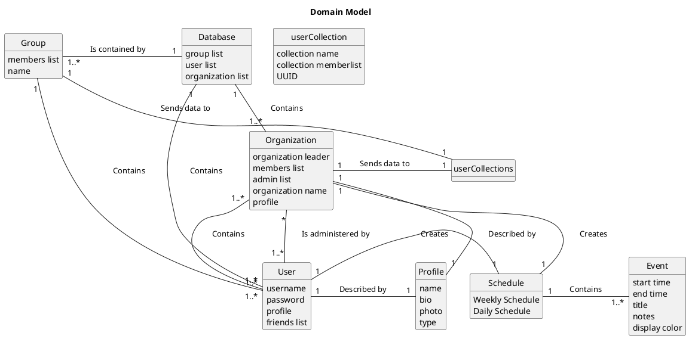


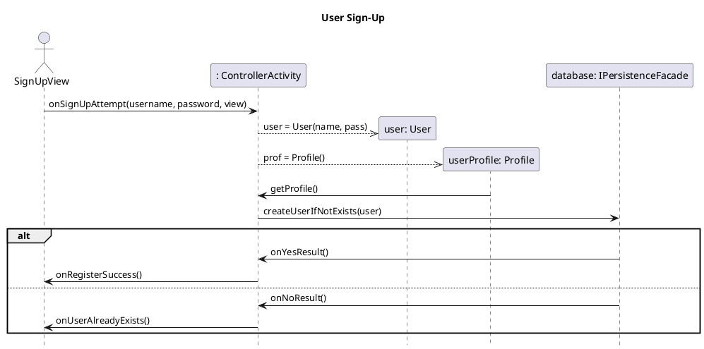

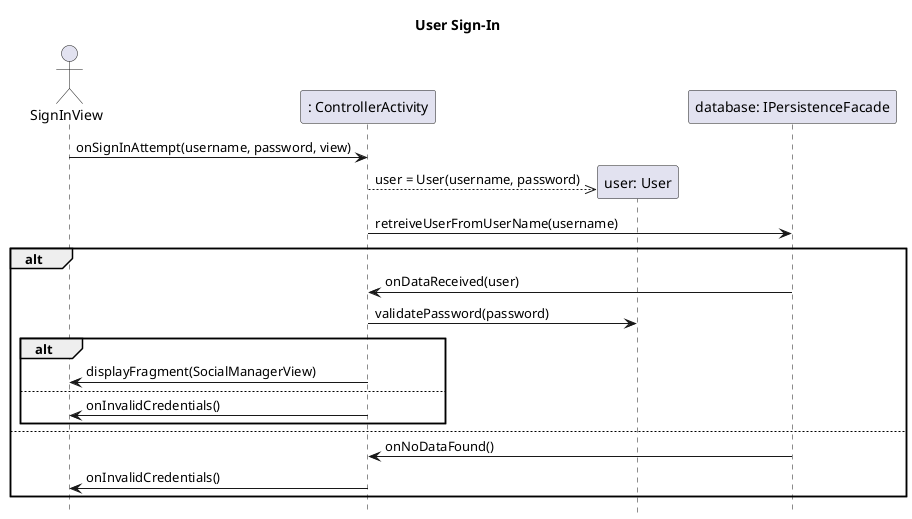
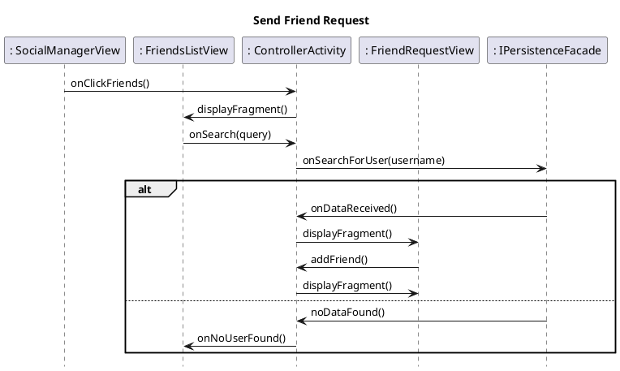

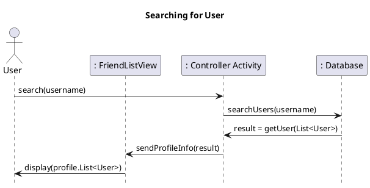

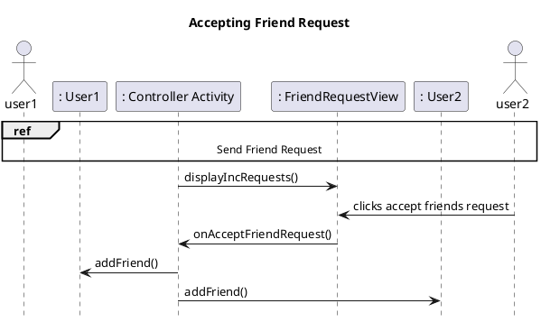
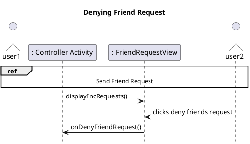

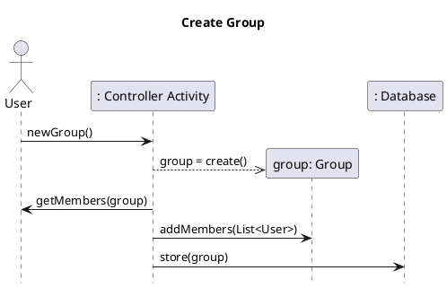

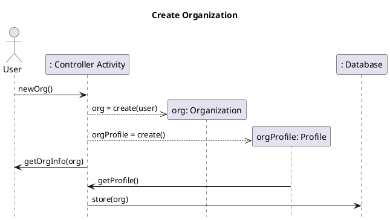

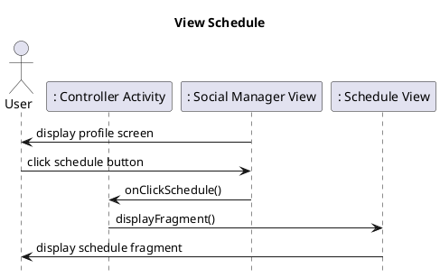
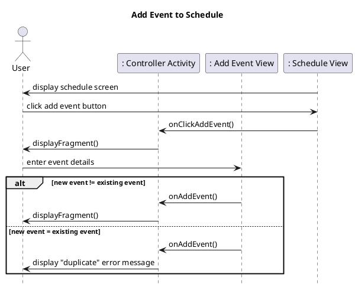

```plantuml
skinparam classAttributeIconSize 0

class User{
--
+User()
+User(String username, String password) : User
+toMap() : Map<String, Object>
+fromMap(MAp<String, Object map) : User
+getUsername() : String
+validatePassword(String password) : boolean 
+setProfile(Profile prof) : void
+getProfile() : void
+getIncPendingRequests() : List<UUID>
+getOutPendingRequests() : List<UUID>
+getFriendsList() : List<UUID>
+addPendingRequest(User user) : boolean
+removePendingRequest(User user) : boolean
+denyRequest(User user) : boolean
+acceptRequest(User user) : boolean
+addFriend(User user) : boolean
+removeFriend(User user) : boolean
+addOrg(Org org) : boolean
+leaveOrg(Org org) : boolean
+addGroup(Group group) : boolean
+leaveGroup(Group, group) : boolean
+getSchedule() : WeeklySchedule
+getOrgList() : List<UUID>
+getGroupList() : List<UUID>
+getUuid() : UUID
+toString() : String
}

class Group{
--
+Group()
+Group(String groupName, ArrayList<User> memberList) : Group
+toMap() : Map<String, Object>
+fromMap(Map<String, Object> map) : Group
+toString() : String
}

class Org{
--
+Org()
+Org(String name, User leader)
+toMap() : Map<String, Object>
+fromMap(Map<String, Object> map) : Org
+getProfile() : Profile
+setProfile(Profile orgProfile) : Profile
+getadminList() : List<User>
+addAdmin(User user) : boolean
+removeAdmin(User user) : boolean
+getSchedule() : WeeklySchedule
+isAdmin(User user) : boolean
+isLeader(User user) : boolean
+getLeader(User user) : User
+toString() : String
}

class Profile{
--
+Profile()
+Profile(String name)
+fromMap(Map<String, Object> map) : Profile
+getName() : String
+getBio() : String
+setBio() : boolean
+getMaxBioChars() : int
+toString() : String
}

class UserCollection{
--
+UserCollection()
+UserCOllection(String name, ArrayList<User> memberList) 
+toMap() : Map<String, Object>
+fromMap(Map<String, Object)> : UserCollection
+getName() : String
+getUUID() : UUID
+getNumMembers() : int
+getMembers() : ArrayList<User>
+isMember() : boolean
+addMember() : boolean
+removeMember() : boolean
+toString() : String
}

class Event{
--
+Event()
+Event(EventTime startTime, Event endTime)
+toMap() : Map<String, Object> 
+fromMap(Map<String, Object map) : Event
+equals(Object o) : boolean
+hashCode() : int
+conflictsWith() : boolean
+setStartTime() : void
+setEndTime() : void
+setTitle() : void
+setNotes() : void
+getTitle() : String
+getStartTime() : EventTime
+getEndTime() : EventTime
+addNote() : void
+removeNote() : void
+getNotes() : List<String>
+getEventColor() : String
+getUuid() : UUID
}

class EventTime{
--
+EventTime()
+EventTime(int hour, int minutes, String format) 
+fromMap(Map<String, Object map) : EventTime
+getHour() : int
+getMinute() : int
+setHour() : void
+setMinute() : void
+equals(Object o) : boolean
+hashCode() : int
+setFormat(String format) : void
+calculateTimeMins() : int
+setFormat() : void
+getFormat() : String
+toString() : String
}

class Weekday{
#id : int
#name : String
+SUNDAY : Weekday
+MONDAY : Weekday
+TUESDAY : Weekday
+WEDNESDAY : Weekday
+THURSDAY : Weekday
+FRIDAY : Weekday
+SATURDAY : Weekday
--
+Weekday()
+Weekday(int id, String name)
+fromMap(Map<String, Object> map)
+values() : List<Weekday>
+getName() : String
+getID() : int
}
class WeeklySchedule{
--
+WeeklySchedule()
+toMap() : Map<String, Object>
+fromMap(Map<String, Object> map) : WeeklyScheudle
+getDailySchedule() : DailySchedule
+addEvent() : void
+removeEvent() : boolean
+rescheduleEvent() : List<Integer>
}

class Database{
--
+Database()
+init(): void
+getUserRepo() : Map<String, User>
+getGroupRepo() : Map<UUID, Group>
+getOrgRepo() : Map<UUID, Org>
+addUser(User user) : void
+addOrg(Org org) : void
+addGroup(Group group) : void
}

class ControllerActivity{
--
#onCreate(Bundle savedInstanceState) : void
+onBackPressed() : void
+onSignInAttempt(String username, String password, ISignUpViewMVC view) : void
+onNoDataFound() : void
+onYesResult() : void
+onNoResult() : void
+createUserIfNotExists(User u) : void
+onClickSchedule() : void
+onClickFriends() : void
+onAddEvent(String title, EventTime startTime, EventTime endTime, Weekday day, View view) : void
+onRequestFriend(user u) : void
+retrieveuserFriendRequests(UUID uuid, IFriendRequestViewMvc view) : void
+onDataReceived(User data) : void
+retrieveUserFriendsList(UUID uuid, IFriendsListViewMvc view) : void
+retrieveorg(UUID uuid, IOrgListViewMvc view) : void
+retrieveGroup(UUID uuid, IGroupViewViewMvc view) : void
+createOrgIfNotExists(Org org) : void
+createGroupIfNotExists(group group) : void
+updateOtherUser(User u) : void
+updateUser() : void
+onCreateGroup(String groupname, ArrayList<User> memberList, ISocialManagerViewMvc socialManagerViewMvc) : void
+onLeaveGroup(Group group, ISocialManagerViewMvc socialManagerViewMvc) : void
+getGroupList() : List<UUID>
+onAddOrg(Org org, ISocialManagerViewMvc socialManagerViewMvc) : void
+onLeaveOrg(Org org, ISocialManagerViewMvc socialManagerViewMvc) : void
+getUserOrgList() : List<UUID>
+getIncRequests() : List<UUID>
+onAcceptRequest(User newFriend) : void
+onDenyRequest(User deniedFriend) : void
+getFriends() : List<UUID>
+onReturnToManager() : void
+onClickViewPending() : void
+onReturnToFriendList() : void
+getCurUsername() : String
+onClickOrganizations() : void
+onSearchForUser(String query, IFriendsListViewMvc view) : void
+onSaveInsanceState(Bundle outState) : void
+getUser() : User
+onRegister(String username, String password, IAuthViewMvc authView) : void
+loadEventsForDay(int day, User u) : List<Event>
+onClickEVent(Event e, View creator, FragmentScheduleBinding binding, boolean canEdit) : Fragment
+onScrollEventList(Fragment f) : void
+closeEventDescription(Fragment f) : void
+onViewFriendScedule(User u) : void
+ deleteEventFromSchedule(Event  event) : void
+returningUser() : void
}

class ResolveFragFactory{
--
+ResolveFragFactory(ControllerActivity controller) : 
+insantiate(Classloader classLoader, String className) : Fragment
}

class AuthKey{
--
+AuthKey()
+AuthKey(String password)
-AuthKey(String salt, String password)
+fromMap(Map<String, Object> map) : AuthKey
+getSalt() : String
+getKey() : String
+validatePassword(String password) : boolean
+generateSalt() : String
+generateKey(String salt, String password) : String
}

class DailySchedule{
+events : List<event>
+day : Weekday
-- 
+DailySchedule()
+DailySchedule(Weekday day)
+getConflicts(Event e) : List<Integer>
+addEvent : List<Integer>
+removeEvent : boolean
+rescheduleEvent : List<Integer>
+getEvents() : List<Event>
}

class MainView{
--
+MainView(FragmentActivity activity)
+getRootView() : View
+displayFragment(Fragment fragment) : void
+addFragment(Fragment fragment) : void
+addFragmentNoBackStack(Fragment fragment) : void
+addFragmentWithAnim(Fragment fragment, int enterAnim, int leaveAnim) : void
+removeFragment(Fragment fragment) : void
+back() : void
}

class OrgListFragment{
--
+onCreateView(LayoutInflater inflater, ViewGroup container, Bundle savedInstanceState) : View
+populateOrgList() : void
+updateDisplay(Org o) : void
+createOrgEntry(String o) : View
+onViewCreated(View view, Bundle savedInstanceState) : void


class SignInFragment{
--
+SignInFragment(Listener listener)
+onCreateView(LayoutInflater inflater, ViewGroup container, Bundle savedInstanceState) : View
+clearFailMessage() : void
+onViewCreated(View view, Bundle savedInstanceState) : void
+beforeTextChanged(CharSequence s, int start, int count, int after) : void
+onTextChanged(CharSequence s, int start, int before, int count) : void
+afterTextChanged(Editable s)
+onInvalidCreds() : void
+onUserAlreadyExists() : void
+setFailMessage(String text) : void
}

class SignUpFragment{
--
+SignUpFragment(Listener listener)
+onCreateView(LayoutInflater inflater, ViewGroup container, Bundle savedInstanceState) : View
+onViewCreated(View view, Bundle savedInstanceState) : void
+beforeTextChanged(CharSequence s, int start, int count, int after) : void
+onTextChanged(CharSequence s, int start, int before, int count) : void
+afterTextChanged(Editable s)
+trySignUp() : void
+onInvalidCreds() : void
+onUserAlreadyExists() : void
+setFailMessage(String text) : void
}

class SocialManagerFragment{
--
+SocialManagerFragment(Listener listener)
+onCreateView(LayoutInflater inflater, ViewGroup container, Bundle savedInstanceState) : View
+onViewCreated(View view, Bundle savedInstanceState) : void
}

class TitleScreenFragment{
--
+TitleScreenFragment() 
+onCreateView(LayoutInflater inflater, ViewGroup container, Bundle savedInstanceState) : View
+onViewCreated(View view, Bundle savedInstanceState) : void
}

class AddEventFragment{
--
+AddEventFragment(Listener listener)
+setDay(Weekday day) : void
+getDirty() : boolean
+setDirty(boolean b) : void
}

class EventDescriptionFragment{
--
+EventDescriptionFragment(IEventDescriptionFragmentMvc.Listener listener, Event event, View creatorView, FragmentScheduleBinding scheduleBinding, boolean canEditSchedule) 
+onCreateView(LayoutInflater inflater, ViewGroup container, Bundle savedInstanceState) : View
+onViewCreated(View view, Bundle savedInstanceState) : void
+removeDeleteButton() : void
+close() : void
}

class FriendsListFragment{
--
+FriendsListFragment(IFriendsListViewMvc.Listener friendListListener, ISocialManagerViewMvc.Listener socialListener)
+onCreateView(LayoutInflater inflater, ViewGroup container, Bundle savedInstanceState) : View
+onViewCreated(View view, Bundle savedInstanceState) : void
+onQueryTextSubmit(String query) : boolean
+onQueryTextChange(String newText) : boolean
+getUserFromSearch(Strng s) : void
+populateFriendList() : void
+updateDisplay(User u, boolean canSendRequest) : void
+clearFriendList() : void
+createNewentry(User u, boolean canSendRequest) : View
}

class FriendRequestFragment{
--
+FriendRequestFragment(IFriendRequestViewMvc.Listener listener)
+onCreateView(LayoutInflater inflater, ViewGroup container, Bundle savedInstanceState) : View
+onViewCreated(View view, Bundle savedInstanceState) : void
+updateDisplay(User u) : void
+createNewentry(User u) : View
}

class GroupViewFragment{
--
+GroupViewFragment(IGroupViewViewMvc.Listener listener)
+populateGroupList() : void
+updateDisplay(Group g) : void
++onCreateView(LayoutInflater inflater, ViewGroup container, Bundle savedInstanceState) : View
+onViewCreated(View view, Bundle savedInstanceState) : void
}
class ScheduleFragment{
--
+ScheduleFragment(Listener listener)
+ScheduleFragment(Listener listener, User u)
+onCreateView(LayoutInflater inflater, ViewGroup container, Bundle savedInstanceState) : View
+setAddEventButtonFragment(Fragment f) : void
+onDestroy() : void
+onViewCreated(View view, Bundle savedInstanceState) : void
+onInflate(Context context, AttributeSet attrs, Bundle savedInstanceState) : View
}


' associations
ResolveFragFactory "1" -down-> "1" ControllerActivity : t\Uses\t\t
ControllerActivity -up-> "1" Database : \tControls\t\t
Group -down-> "1" UserCollection 
Org -right-> "*" Profile: \tContains\t\t
Database "1" -down-> "*" User : \tContains\t\t
User --up--> WeeklySchedule 
Database "1" - "*" Org : \tContains\t\t
UserCollection -down-> Group
WeeklySchedule -left-> Event
WeeklySchedule -right-> Weekday
WeeklySchedule "1" -down-> "7" DailySchedule
DailySchedule "1" -> "*" Event
Event - EventTime
User "1" -down-> "1" Profile 
Org -down-> UserCollection
User "1" -down-> "1" AuthKey : \thas\t\t
MainView -down-> ControllerActivity : \tuses\t\t
MainView -up-> GroupViewFragment : \tcontains\t\t
MainView -up-> FriendRequestFragment : \tcontains\t\t
MainView -left-> FriendsListFragment : \tcontains\t\t
MainView -up-> EventDescriptionFragment : \tcontains\t\t
MainView -down-> AddEventFragment : \tcontains\t\t
MainView -down-> TitleScreenFragment : \tcontains\t\t
MainView --down-> SocialManagerFragment : \tcontains\t\t
MainView -right-> SignUpFragment : \tcontains\t\t
MainView -down-> ScheduleFragment : \tcontains\t\t
MainView -down-> OrgListFragment : \tcontains\t\t
MainView --down-> SignInFragment : \tcontains\t\t
