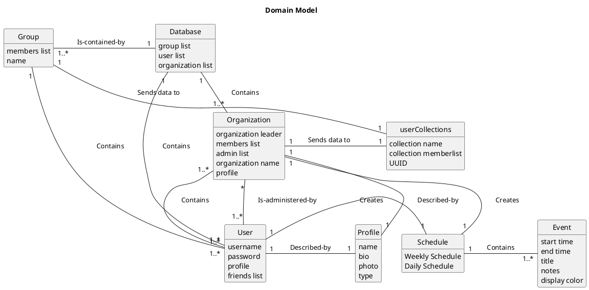
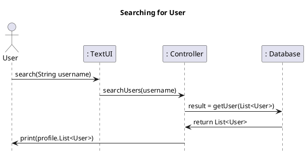
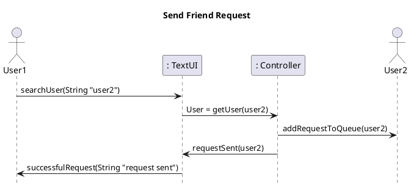
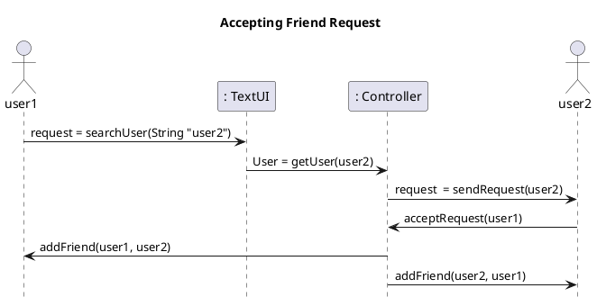
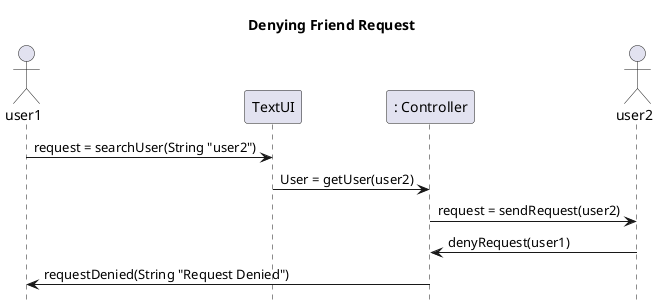
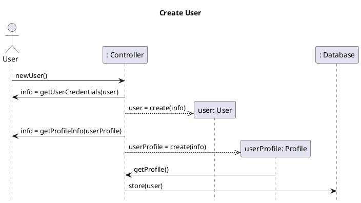
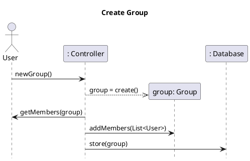
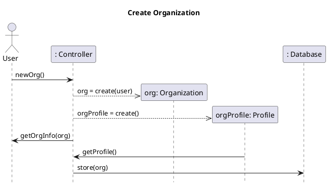

```plantuml
skinparam classAttributeIconSize 0

class User{
-username : String
-password : String
-friendsList : List<User>
-orgList : List<UUID>
-groupList : List<UUID>
-numFriends : int
-incPendingRequests : List<User>
-outPendingRequests : List<User>
-profile: Profile
--
User(String username, String password) : User
+getUsername() : String
+getPassword() : String
+setProfile(Profile prof) : void
+getProfile() : void
+getIncPendingRequests() : List<User>
+getOutPendingRequests() : List<User>
+getFriendsList() : List<User>
+addPendingRequest(User user) : boolean
+removePendingRequest(User user) : boolean
+denyRequest(User user) : boolean
+acceptRequest(User user) : boolean
+addFriend(User user) : boolean
+removeFriend(User user) : boolean
+addOrg(Org org) : boolean
+leaveOrg(Org org) : boolean
+addGroup(Group group) : boolean
+leaveGroup(Group, group) : boolean
+getOrgList() : List<UUID>
+getGroupList() : List<UUID>
+getNumFriends() : boolean
+toString() : String
}

class Group{
--
+Group(String groupName, List<User> memberList) : Group
+ toString() : String
}

class Org{
-leader : User
-profile : Profile
-adminList : List<User>
--
Org(String name, User leader)
+ getProfile() : Profile
+ setProfile(Profile orgProfile) : Profile
+ getadminList() : List<User>
+ addAdmin(User user) : boolean
+ removeAdmin(User user) : boolean
+ isAdmin(User user) : boolean
+ isLeader(User user) : boolean
+ getLeader(User user) : User
+ toString() : String
}

class Profile{
-name : String
-bio : String
- maxBioChars : static final int 
--
Profile(String name)
+getName() : String
+getBio() : String
+setBio() : boolean
+toString() : boolean
+getMaxBioChars() : int
+toString() : String
}
class UserCollections{
-name : String
-numMembers : int
-memberList : ArrayList<User>
-uuid : UUID
--
+UserCollection()
+getName() : String
+getUUID() : UUID
+getMembers() : ArrayList<User>
+isMember() : boolean
+addMember() : boolean
+removeMember() : boolean
+toString() : String
}

class Event{
-title : String
-eventColor : String
-startTime : EventTime
-endTime : EventTime
-notes : List<String>
--
+Event()
+conflictsWith() : boolean
+setStartTime() : void
+setEndTime() : void
+setTitle() : void
+setNotes() : void
+getTitle() : String
+getStartTime() : EventTime
+getEndTime() : EventTime
+addNote() : void
+removeNote() : void
+getNotes() : List<String>
}
class EventTime{
-hour : int
-min : int
-format : String
--
+EventTime()
+getHour() : int
+getMinute() : int
+setHour() : void
+setMinute() : void
+setFormat() : void
+getTimeMins() : int
+getFormat() : String
}
class Weekday{
#id : int
#name : String
--
+Weekday()
+getName() : String
+getID() : int
}
class WeeklySchedule{
-days : DailySchedule[]
--
+WeeklySchedule()
+getDailySchedule() : DailySchedule
+addEvent() : void
+removeEvent() : boolean
+rescheduleEvent() : List<Integer>
}

class Database{
-userRepo : Map<String, User>
-groupRepo : Map<UUID, Group>
-orgRepo : Map<UUID, Org>
--
+getUserRepo() : Map<String, User>
+getGroupRepo() : Map<UUID, Group>
+getOrgRepo() : Map<UUID, Org>
+addUser(User user) : void
+addOrg(Org org) : void
+addGroup(Group group) : void
}

class Controller{
+createUser(String username, String password, String name, String bio) : User
+validateCreds(String username, String password) : User
+userExists(String username) : boolean
+orgExists(UUID) : boolean
+groupsExists(UUID) : boolean
+getOrg(UUID) : Org
+getUser(String username) : User
+startGroup(User user) : void
+startOrg(String name, User user) : boolean
+searchOrg(String orgName) : Org
}


User -> "1\nprofile" Profile
Org --> "1\nprofile"Profile
Database  -> "*\nuserList\n{HashMap}"User
Database  ---> "*\ngroupList\n{HashMap}"Group
Database  --> "*\norgList\n{HashMap}"Org
Controller -->"1\ncontrols" Database
UserCollections <|-- Group
UserCollections <|-- Org
User --> WeeklySchedule
WeeklySchedule --> Weekday
Event --> EventTime
WeeklySchedule --> Event
```